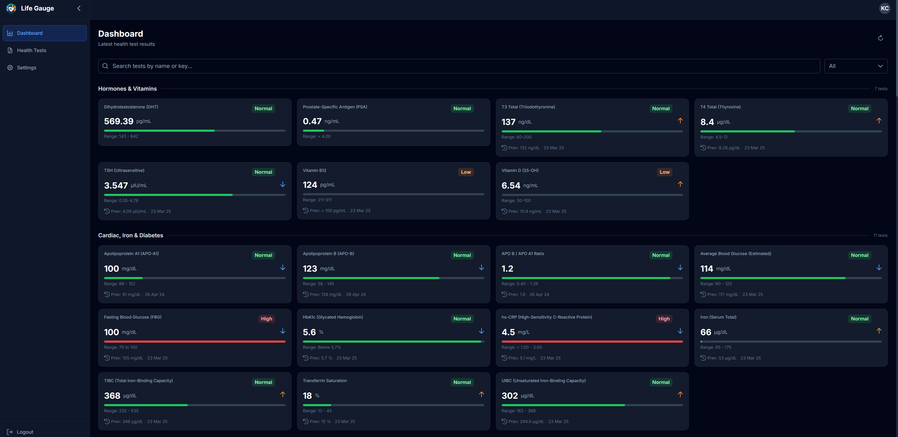
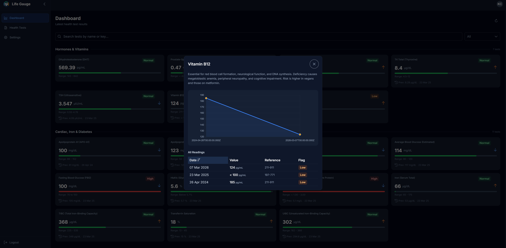
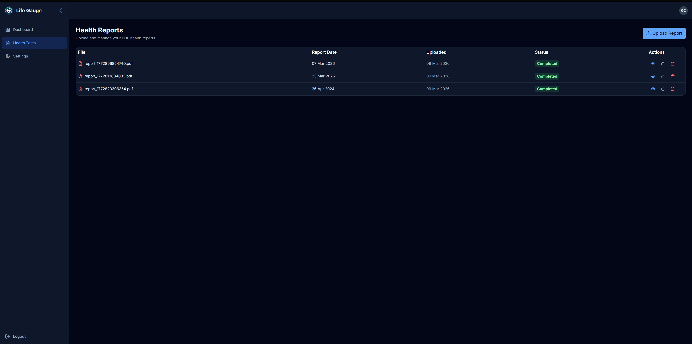
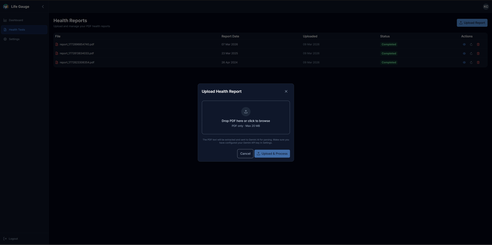
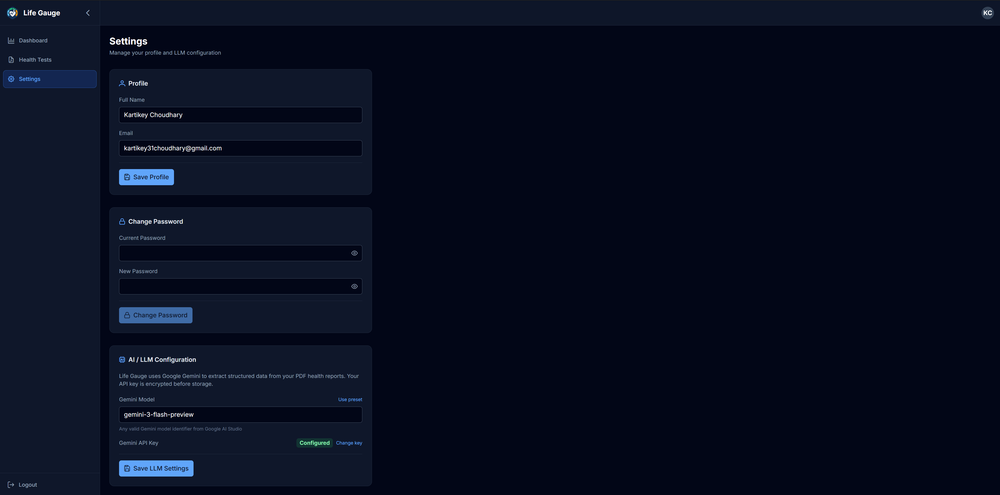
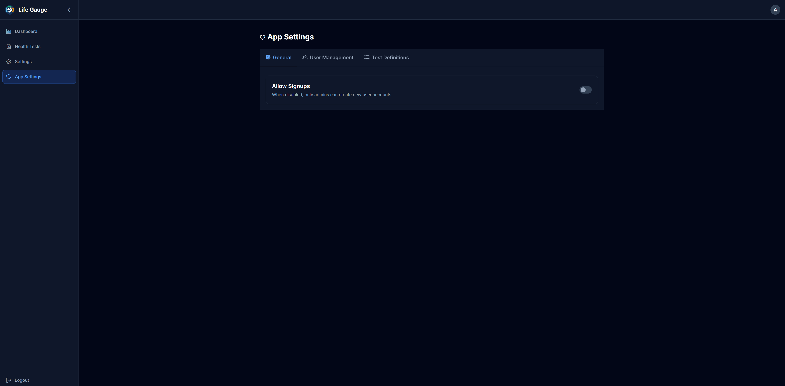
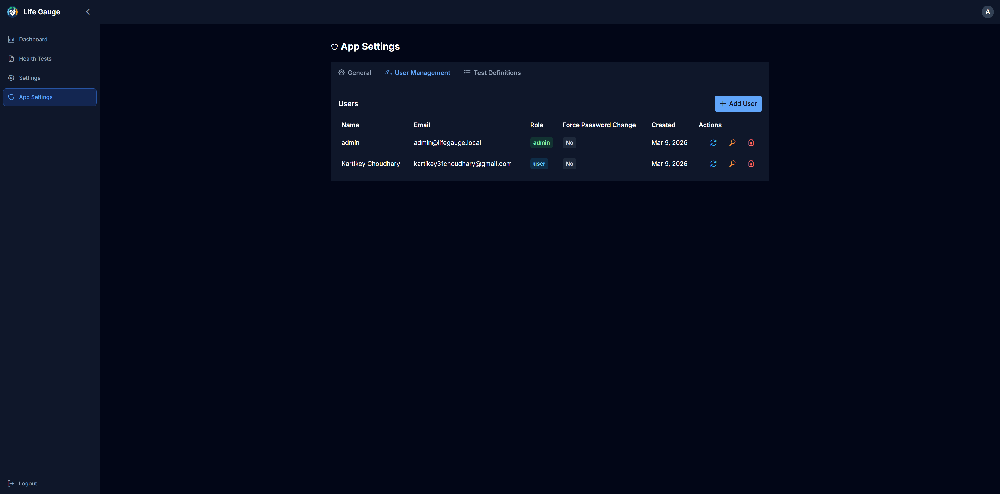
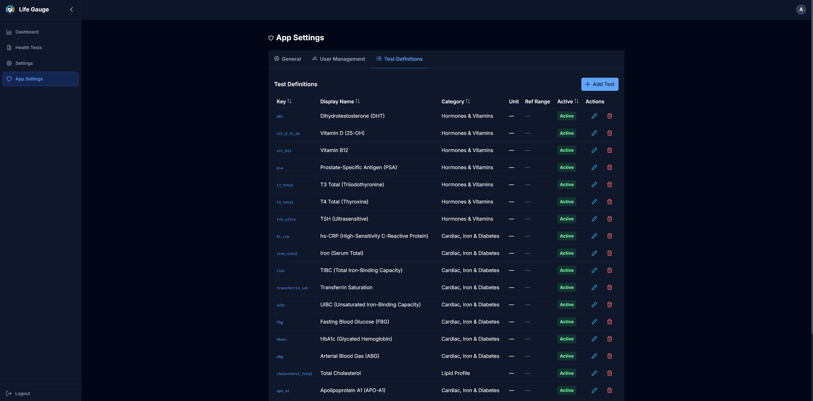
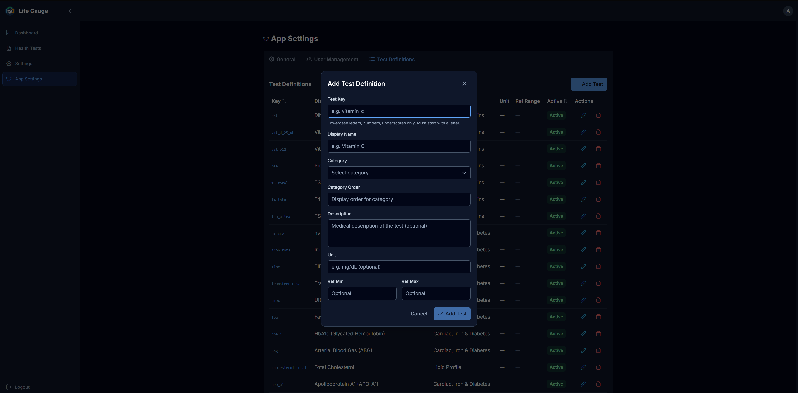

# Life Gauge

A full-stack web application for logging and monitoring personal health reports. Upload PDF health reports and let Google Gemini AI extract structured test data — then track trends, compare results, and monitor your health over time.

## Screenshots

| | |
|---|---|
|  |  |
| Dashboard — test results by category | Test History — trends with reference ranges |
|  |  |
| Health Reports — uploaded PDF list | Upload — drag & drop PDF upload |
|  |  |
| User Settings | Admin — General Settings |
|  |  |
| Admin — User Management | Admin — Test Definitions |
|  | |
| Admin — Add/Edit Test Definition | |

---

> **Important: Google Gemini API Key Required**
>
> This application uses **Google Gemini AI** to parse uploaded health report PDFs and extract structured test data. Without a Gemini API key, the core upload and parsing functionality will not work.
>
> **How to get a Gemini API key:**
> 1. Go to [Google AI Studio](https://aistudio.google.com/apikey)
> 2. Sign in with your Google account
> 3. Click **"Create API Key"** and select or create a Google Cloud project
> 4. Copy the generated API key
> 5. In Life Gauge, go to **Settings > LLM Configuration** and paste the API key
>
> The free tier of Gemini API provides generous usage limits sufficient for personal health report parsing. The API key is encrypted (AES-256-GCM) before being stored in the database.

---

## Features

- **PDF Upload & AI Parsing** — Upload health report PDFs; Google Gemini extracts individual test values into structured data
- **Dashboard** — Latest test results grouped by category with flag indicators (normal/high/low), trend arrows, and reference range bars
- **Test History** — Drill into any test to see a historical chart with reference range overlay and medical description
- **Admin Panel** — Manage users, control signups, and configure 111+ test definitions
- **Dark Theme** — PrimeNG Aura dark theme throughout

## Tech Stack

| Layer | Technology |
|-------|-----------|
| Backend | Node.js 20, Express 4, Knex.js, MySQL 8 |
| Frontend | Angular 21, PrimeNG 21, Tailwind CSS 3, AG Grid |
| AI | Google Gemini (`@google/generative-ai`) |
| Auth | JWT (jsonwebtoken + bcryptjs) |
| Containerization | Docker, Docker Compose, nginx |

---

## Deployment

### Option 1: Local Development (without Docker)

Best for active development and debugging.

**Prerequisites:** Node.js 20+, MySQL 8, npm

```bash
# 1. Clone and configure
git clone https://github.com/kartikeychoudhary/life-gauge.git
cd life-gauge
cp .env.example .env
# Edit .env — set DB_PASSWORD, JWT_SECRET, ENCRYPTION_KEY (32 chars)
```

```bash
# 2. Start MySQL and create the database
mysql -u root -p -e "CREATE DATABASE IF NOT EXISTS life_gauge;"
```

```bash
# 3. Backend
cd life-gauge-api
npm install
npx knex migrate:latest --env production
npm run dev    # starts with nodemon on API_PORT (default 3001)
```

```bash
# 4. Frontend (in a new terminal)
cd life-gauge-web
npm install
npx ng serve   # starts on NG_PORT (default 4201)
```

Open `http://localhost:4201`. Default admin credentials: `admin@lifegauge.local` / `admin` (you'll be prompted to change the password on first login).

---

### Option 2: Docker Compose — Local Build

Builds images from source. Good for testing the full Docker stack locally.

**Prerequisites:** Docker Desktop

```bash
# 1. Clone and configure
git clone https://github.com/kartikeychoudhary/life-gauge.git
cd life-gauge
cp .env.example .env
# Edit .env — set DB_PASSWORD, JWT_SECRET, ENCRYPTION_KEY (32 chars)
```

```bash
# 2. Start all services
docker compose up -d
```

This starts three containers:
- **db** — MySQL 8 with a persistent volume
- **api** — Node.js backend (runs migrations automatically on startup)
- **web** — nginx serving the Angular app + proxying `/api/` to the backend

```bash
# View logs
docker compose logs -f api
docker compose logs -f web

# Stop
docker compose down

# Stop and remove data
docker compose down -v
```

Open `http://localhost:<NG_PORT>` (default from `.env`). Default admin credentials: `admin@lifegauge.local` / `admin` (you'll be prompted to change the password on first login).

---

### Option 3: Production Deployment (Pre-built Docker Hub Images)

Uses pre-built images from Docker Hub. No source code or build tools required. Recommended for production.

**Prerequisites:** Docker, internet access

```bash
# 1. Create a directory and download config files
mkdir life-gauge && cd life-gauge
curl -O https://raw.githubusercontent.com/kartikeychoudhary/life-gauge/main/docker-compose.prod.yml
curl -O https://raw.githubusercontent.com/kartikeychoudhary/life-gauge/main/.env.example

cp .env.example .env
```

Edit `.env` with strong production values:

| Variable | Notes |
|----------|-------|
| `DB_PASSWORD` | Strong MySQL root password |
| `JWT_SECRET` | Random 32+ character string |
| `ENCRYPTION_KEY` | Exactly 32 characters for AES-256 |

```bash
# 2. Start with a specific version
LIFE_GAUGE_VERSION=v1.1.0 docker compose -f docker-compose.prod.yml up -d
```

Or use `latest`:
```bash
docker compose -f docker-compose.prod.yml up -d
```

Open `http://localhost:<NG_PORT>` (default `4200`). Default admin credentials: `admin@lifegauge.local` / `admin` (you'll be prompted to change the password on first login).

**Docker Hub images:**
- [`kartikey31choudhary/life-gauge-api`](https://hub.docker.com/r/kartikey31choudhary/life-gauge-api)
- [`kartikey31choudhary/life-gauge-web`](https://hub.docker.com/r/kartikey31choudhary/life-gauge-web)

---

## Environment Variables

All configuration lives in a single `.env` file at the project root. See [.env.example](.env.example) for the template. Never commit this file — it is git-ignored.

| Variable | Default | Description |
|----------|---------|-------------|
| `DB_HOST` | `localhost` | MySQL host |
| `DB_PORT` | `3306` | MySQL port (host-mapped; Docker internal always uses 3306) |
| `DB_NAME` | `life_gauge` | Database name |
| `DB_USER` | `root` | Database user |
| `DB_PASSWORD` | — | Database password **(required)** |
| `JWT_SECRET` | — | JWT signing key **(required)** |
| `JWT_EXPIRY` | `24h` | Token expiry duration |
| `ENCRYPTION_KEY` | — | AES-256 key for API key storage **(required, exactly 32 chars)** |
| `API_PORT` | `3000` | Backend port |
| `NG_PORT` | `4200` | Frontend port |
| `UPLOAD_DIR` | `uploads` | PDF upload directory |
| `MAX_FILE_SIZE_MB` | `20` | Max upload size in MB |

---

## Default Admin Credentials

On first run (when no users exist), a default admin account is created automatically:

| Field | Value |
|-------|-------|
| Email | `admin@lifegauge.local` |
| Password | `admin` |
| Role | `admin` |

You will be prompted to change the password on first login.

---

## Database Migrations

Migrations run automatically when the API starts in Docker. To run manually:

```bash
# Local
cd life-gauge-api && npx knex migrate:latest --env production

# Docker
docker compose exec api npx knex migrate:latest --env production

# Rollback
cd life-gauge-api && npx knex migrate:rollback
```

---

## Project Structure

```
life-gauge/
├── life-gauge-api/          # Node.js Express backend
├── life-gauge-web/          # Angular frontend
├── docker-compose.yml       # Local build (development/testing)
├── docker-compose.prod.yml  # Pre-built images (production)
├── .env.example             # Environment variable template
├── docs/                    # Project documentation
│   ├── PROJECT_SUMMARY.md   # High-level overview
│   ├── PROJECT_HISTORY.md   # Chronological changelog
│   ├── API_SPEC.md          # REST API reference
│   ├── BACKEND_SPEC.md      # DB schema & backend architecture
│   ├── RELEASE.md           # Release process guide
│   └── feature/             # Per-feature docs (api/ and web/)
└── CLAUDE.md                # AI assistant instructions
```

---

## Documentation

| File | Description |
|------|-------------|
| [docs/PROJECT_SUMMARY.md](docs/PROJECT_SUMMARY.md) | High-level overview — modules, tech stack, DB tables |
| [docs/PROJECT_HISTORY.md](docs/PROJECT_HISTORY.md) | Chronological changelog of features and fixes |
| [docs/API_SPEC.md](docs/API_SPEC.md) | Full REST API reference (endpoints, request/response shapes) |
| [docs/BACKEND_SPEC.md](docs/BACKEND_SPEC.md) | DB schema, migrations, backend architecture decisions |
| [docs/RELEASE.md](docs/RELEASE.md) | Release process for Docker Hub and GitHub releases |
| [docs/DEVELOPMENT_PROCESS.md](docs/DEVELOPMENT_PROCESS.md) | Step-by-step process for adding features |
| [docs/feature/](docs/feature/) | Per-feature docs split by `api/` and `web/` |

---

## License

Private project by Kartikey Choudhary.
